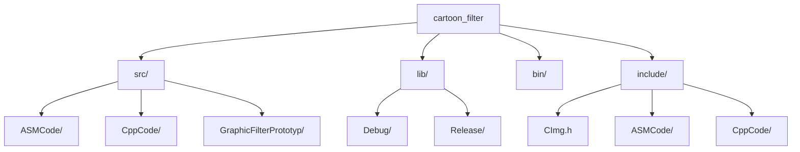

# Project Architecture Overview

## Directory Structure



## Migration Plan

### 1. Directory Reorganization
- Create core directories:
  ```bash
  mkdir src lib bin include
  ```
- Move existing projects to src/:
  ```bash
  mv ASMCode/ CppCode/ GraphicFilterPrototyp/ src/
  ```
- Move shared headers to include/:
  ```bash
  mv CImg.h include/
  ```

### 2. Project File Modifications
- Update .vcxproj files to use new output paths:
  ```xml
  <PropertyGroup>
    <OutputPath>..\lib\$(Configuration)\</OutputPath>
    <IntermediateOutputPath>obj\$(Configuration)\</IntermediateOutputPath>
  </PropertyGroup>
  ```

### 3. Build Process
- Add post-build events in C# project:
  ```xml
  <PostBuildEvent>
    copy "$(OutDir)*.dll" "..\bin\$(Configuration)\"
  </PostBuildEvent>
  ```

### 4. Version Control
- Update .gitignore:
  ```gitignore
  /lib/
  /bin/
  /obj/
  ```

## Dependency Management
| Component        | Location          | Responsibility       |
|------------------|-------------------|----------------------|
| ASMCode DLL      | lib/[config]      | Low-level operations |
| CppCode DLL      | lib/[config]      | Image processing     |
| CImg headers     | include/          | Image manipulation   |