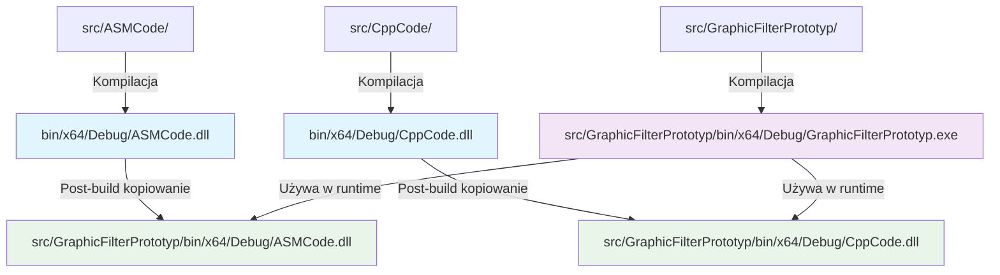

# cartoon_filter

## Description
A Windows Forms application that applies cartoon-like effects to images. The project demonstrates the integration of three different programming languages (C#, C++, and Assembly) to create an efficient image processing solution.

### Key Features
- Load and process various image formats (BMP, JPG, PNG)
- Apply cartoon-style filters to images
- Optimized performance using SIMD instructions in Assembly
- Multi-threaded processing utilizing all available CPU cores

### Technical Details
The project consists of three main components:
1. **C# Windows Forms Application**
   - Provides the user interface
   - Handles image loading and display
   - Manages the integration between components

2. **C++ DLL**
   - Implements basic pixel processing functions
   - Provides pixel value calculation algorithms

3. **Assembly DLL**
   - Contains optimized versions of image processing functions
   - Uses SIMD instructions for better performance
   - Processes multiple pixels simultaneously

### System Requirements
- Windows operating system
- x64 architecture
- .NET Framework support

### Building the Project
Open the solution in Visual Studio and build all projects. Make sure to build for x64 architecture.

### Density parameter
The `density` parameter (called `value` in the code) controls how much the image colors are simplified. Lower values cause a stronger cartoon/posterization effect (more color grouping), higher values keep the image closer to the original. Technically, it is the divider in the modulo operation for each color channel.

---
 
## Opis
Aplikacja Windows Forms służąca do nakładania efektów komiksowych na obrazy. Projekt demonstruje integrację trzech różnych języków programowania (C#, C++ i Assembly) w celu stworzenia wydajnego rozwiązania do przetwarzania obrazów.

## Struktura projektu

```bash
cartoon_filter/
├── src/
│   ├── ASMCode/           # Kod źródłowy Assembly z optymalizacjami SIMD
│   ├── CppCode/           # Implementacja podstawowych operacji na obrazach w C++
│   └── GraphicFilterPrototyp/  # Aplikacja C# z interfejsem użytkownika
├── include/               # Wspólne pliki nagłówkowe (CImg.h)
├── bin/                   # Skompilowane biblioteki DLL i pliki wykonywalne
├── ARCHITECTURE.md        # Dokumentacja architektury systemu
└── README.md              # Instrukcja i opis projektu
```

### Diagram procesu budowania:


### Szczegóły komponentów:
1. **ASMCode** - Zawiera funkcje niskopoziomowe zoptymalizowane przy użyciu:
   - Instrukcji SIMD (SSE/AVX) do równoległego przetwarzania pikseli
   - Asemblera x64 dla krytycznych ścieżek wykonania
   - Optymalizacji pod kątem minimalnego zużycia pamięci

2. **CppCode** - Implementuje:
   - Podstawowe operacje na pikselach (modyfikacje kolorów, filtry)
   - Logikę zarządzania bitmapami
   - Interfejsy C-style do komunikacji z warstwą asemblerową

3. **GraphicFilterPrototyp** - Aplikacja główna:
   - GUI z możliwością wyboru obrazu i parametrów filtra
   - Mechanizm wywoływania funkcji z bibliotek DLL
   - Obsługa wielowątkowego przetwarzania
   - Wizualizacja wyników w czasie rzeczywistym

### Przepływ danych:
```mermaid
graph TD
    A[Obraz wejściowy] --> B[Wczytywanie i przetwarzanie wstępne - C#]
    B --> C[Przetwarzanie obrazu - C++]
    C --> D[Optymalizacje niskopoziomowe - ASM]
    D --> E[Renderowanie wyników - C#]
    E --> F[Obraz wyjściowy]

### Opis procesu kompilacji:

1. **Kompilacja natywnych bibliotek:**
   - ASMCode i CppCode budują się bezpośrednio do `bin/x64/Debug/` (lub Release)
   - Biblioteki zawierają zoptymalizowane funkcje przetwarzania obrazów

2. **Kompilacja aplikacji C#:**
   - GraphicFilterPrototyp buduje się do własnego katalogu `src/GraphicFilterPrototyp/bin/x64/Debug/`
   - Po kompilacji uruchamia się post-build event

3. **Post-build kopiowanie:**
   - DLL są kopiowane z `bin/x64/Debug/` do katalogu aplikacji
   - Zapewnia to dostęp do bibliotek w czasie uruchomienia

## Informacje dodatkowe

- Natywne biblioteki DLL (ASMCode.dll, CppCode.dll) są kompilowane bezpośrednio do `bin/x64/Debug/`
- Post-build event w projekcie C# kopiuje te DLL do katalogu aplikacji
- Struktura umożliwia łatwe uruchomienie aplikacji bez dodatkowej konfiguracji
- Katalogi `bin/` i `obj/` są ignorowane przez system kontroli wersji (git)


### Główne Funkcje
- Wczytywanie i przetwarzanie różnych formatów obrazów (BMP, JPG, PNG)
- Nakładanie filtrów typu komiksowego na obrazy
- Zoptymalizowana wydajność dzięki instrukcjom SIMD w Assembly
- Przetwarzanie wielowątkowe wykorzystujące wszystkie dostępne rdzenie CPU

### Szczegóły Techniczne
Projekt składa się z trzech głównych komponentów:
1. **Aplikacja Windows Forms w C#**
   - Zapewnia interfejs użytkownika
   - Obsługuje wczytywanie i wyświetlanie obrazów
   - Zarządza integracją między komponentami

2. **Biblioteka DLL w C++**
   - Implementuje podstawowe funkcje przetwarzania pikseli
   - Dostarcza algorytmy obliczania wartości pikseli

3. **Biblioteka DLL w Assembly**
   - Zawiera zoptymalizowane wersje funkcji przetwarzania obrazów
   - Wykorzystuje instrukcje SIMD dla lepszej wydajności
   - Przetwarza wiele pikseli jednocześnie

### Wymagania Systemowe
- System operacyjny Windows
- Architektura x64
- Wsparcie dla .NET Framework

### Kompilacja Projektu
Otwórz rozwiązanie w Visual Studio i skompiluj wszystkie projekty. Upewnij się, że wybrana jest architektura x64.

### Parametr density
Parametr `density` (w kodzie jako `value`) określa stopień uproszczenia kolorów na obrazie. Niższe wartości powodują silniejszy efekt komiksowy (większe grupowanie kolorów), wyższe wartości zachowują więcej oryginalnych kolorów. Technicznie jest to dzielnik w operacji modulo dla każdej składowej koloru.
