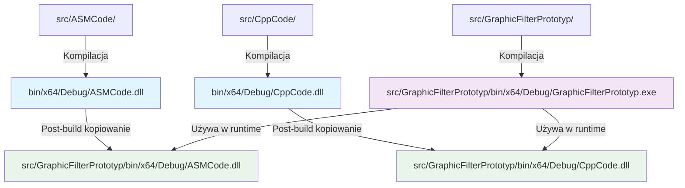
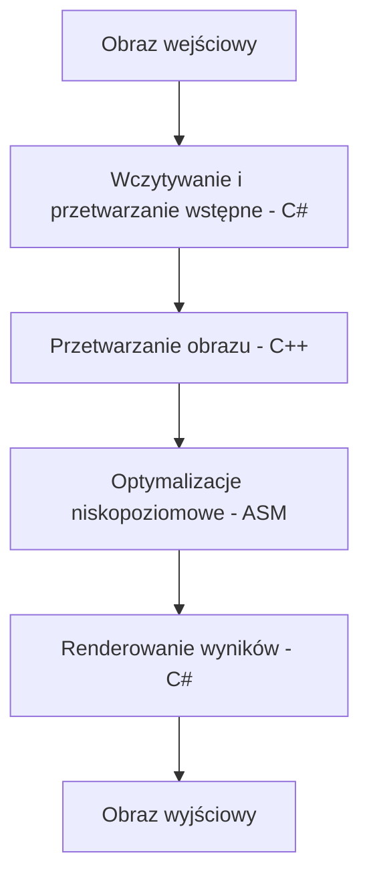

# cartoon_filter

## Description

A Windows Forms application that applies cartoon-like effects to images. The project demonstrates the integration of three different programming languages (C#, C++, and Assembly) to create an efficient image processing solution.

### Key Features
- Load and process various image formats (BMP, JPG, PNG)
- Apply cartoon-style filters to images
- Optimized performance using SIMD instructions in Assembly
- Multi-threaded processing utilizing all available CPU cores

### Technical Details
The project consists of three main components:
1. **C# Windows Forms Application**
   - Provides the user interface
   - Handles image loading and display
   - Manages the integration between components

2. **C++ DLL**
   - Implements basic pixel processing functions
   - Provides pixel value calculation algorithms

3. **Assembly DLL**
   - Contains optimized versions of image processing functions
   - Uses SIMD instructions for better performance
   - Processes multiple pixels simultaneously

### System Requirements
- Windows operating system
- x64 architecture
- .NET Framework support

### Building the Project
Open the solution in Visual Studio and build all projects. Make sure to build for x64 architecture.

### Using the Application
1. Launch the application
2. Click "Load Image" to select an image file
3. Adjust the filter parameters:
   - Density: Controls the level of detail in the cartoon effect
   - Other parameters can be adjusted using the provided sliders
4. Click "Apply Filter" to process the image
5. Save the processed image using "Save Image" button

### Parameters
#### Density
The density parameter controls how detailed the cartoon effect will be:
- Lower values (1-3): More cartoon-like, fewer details
- Medium values (4-6): Balanced effect with moderate detail
- Higher values (7-10): More detailed, closer to the original image

### Troubleshooting
If you encounter any issues:
- Ensure all DLLs are present in the application directory
- Verify your system meets the minimum requirements
- Check if the input image format is supported

### Density parameter
:start_line:38
-------
The `density` parameter (called `value` in the code) controls how much the image colors are simplified. Lower values cause a stronger cartoon/posterization effect (more color grouping), higher values keep the image closer to the original. Technically, it is the divider in the modulo operation for each color channel.

**Improvements for code readability, performance, best practices, and error handling:**

1. **Code readability and maintainability:**
   - Use descriptive variable names instead of generic ones like `value`. For example, rename `value` to `density` to match the parameter's conceptual meaning.
   - Add comments explaining the purpose of key operations, especially the quantization logic.
   - Encapsulate the quantization logic in a dedicated function for reuse and clarity.

2. **Performance optimization:**
   - Avoid repeated modulo operations inside tight loops by precomputing values where possible.
   - Use integer arithmetic for color quantization to improve speed.
   - Consider clamping the `density` parameter to valid ranges upfront to avoid unnecessary checks inside loops.

3. **Best practices and patterns:**
   - Validate input parameters early and throw meaningful errors or warnings if out of expected range.
   - Use constants or configuration parameters for magic numbers.
   - Follow consistent naming conventions and code formatting.

4. **Error handling and edge cases:**
   - Handle edge cases where `density` might be zero or negative to prevent division/modulo by zero errors.
   - Provide fallback or default values if input is invalid.
   - Ensure the function gracefully handles extreme values without crashing or producing unexpected results.

**Example improved code snippet:**

```cpp
// Quantizes a single color channel value based on the density parameter.
// density controls the level of color simplification: higher density means finer color detail.
inline uint8_t QuantizeColorChannel(uint8_t colorValue, int density) {
    if (density <= 0) {
        // Avoid division by zero or negative density; return original color.
        return colorValue;
    }
    // Quantize color by reducing the number of possible shades.
    // This groups colors into buckets of size 'density'.
    return static_cast<uint8_t>((colorValue / density) * density);
}

// Usage example inside image processing loop:
// for each pixel channel:
//   pixel[channel] = QuantizeColorChannel(pixel[channel], density);
```

This approach improves clarity by naming the function and variables meaningfully, adds input validation, and uses integer division for efficient quantization. It also documents the logic clearly for maintainers. Edge cases like zero or negative density are handled gracefully by returning the original color value.

---

## Opis

Aplikacja Windows Forms służąca do nakładania efektów komiksowych na obrazy. Projekt demonstruje integrację trzech różnych języków programowania (C#, C++ i Assembly) w celu stworzenia wydajnego rozwiązania do przetwarzania obrazów.

## Struktura projektu


```bash
cartoon_filter/
├── src/
│   ├── ASMCode/           # Kod źródłowy Assembly z optymalizacjami SIMD
│   ├── CppCode/           # Implementacja podstawowych operacji na obrazach w C++
│   └── GraphicFilterPrototyp/  # Aplikacja C# z interfejsem użytkownika
├── include/               # Wspólne pliki nagłówkowe (CImg.h)
├── bin/                   # Skompilowane biblioteki DLL i pliki wykonywalne
├── ARCHITECTURE.md        # Dokumentacja architektury systemu
└── README.md              # Instrukcja i opis projektu
```

### Diagram procesu budowania:


### Szczegóły komponentów:
1. **ASMCode** - Zawiera funkcje niskopoziomowe zoptymalizowane przy użyciu:
   - Instrukcji SIMD (SSE/AVX) do równoległego przetwarzania pikseli
   - Asemblera x64 dla krytycznych ścieżek wykonania
   - Optymalizacji pod kątem minimalnego zużycia pamięci

2. **CppCode** - Implementuje:
   - Podstawowe operacje na pikselach (modyfikacje kolorów, filtry)
   - Logikę zarządzania bitmapami
   - Interfejsy C-style do komunikacji z warstwą asemblerową

3. **GraphicFilterPrototyp** - Aplikacja główna:
   - GUI z możliwością wyboru obrazu i parametrów filtra
   - Mechanizm wywoływania funkcji z bibliotek DLL
   - Obsługa wielowątkowego przetwarzania
   - Wizualizacja wyników w czasie rzeczywistym

### Przepływ danych:


### Opis procesu kompilacji:


1. **Kompilacja natywnych bibliotek:**
   - ASMCode i CppCode budują się bezpośrednio do `bin/x64/Debug/` (lub Release)
   - Biblioteki zawierają zoptymalizowane funkcje przetwarzania obrazów

2. **Kompilacja aplikacji C#:**
   - GraphicFilterPrototyp buduje się do własnego katalogu `src/GraphicFilterPrototyp/bin/x64/Debug/`
   - Po kompilacji uruchamia się post-build event

3. **Post-build kopiowanie:**
   - DLL są kopiowane z `bin/x64/Debug/` do katalogu aplikacji
   - Zapewnia to dostęp do bibliotek w czasie uruchomienia

## Informacje dodatkowe


- Natywne biblioteki DLL (ASMCode.dll, CppCode.dll) są kompilowane bezpośrednio do `bin/x64/Debug/`
- Post-build event w projekcie C# kopiuje te DLL do katalogu aplikacji
- Struktura umożliwia łatwe uruchomienie aplikacji bez dodatkowej konfiguracji
- Katalogi `bin/` i `obj/` są ignorowane przez system kontroli wersji (git)

### Główne Funkcje

- Wczytywanie i przetwarzanie różnych formatów obrazów (BMP, JPG, PNG)
- Nakładanie filtrów typu komiksowego na obrazy
- Zoptymalizowana wydajność dzięki instrukcjom SIMD w Assembly
- Przetwarzanie wielowątkowe wykorzystujące wszystkie dostępne rdzenie CPU

### Szczegóły Techniczne

Projekt składa się z trzech głównych komponentów:
1. **Aplikacja Windows Forms w C#**
   - Zapewnia interfejs użytkownika
   - Obsługuje wczytywanie i wyświetlanie obrazów
   - Zarządza integracją między komponentami

2. **Biblioteka DLL w C++**
   - Implementuje podstawowe funkcje przetwarzania pikseli
   - Dostarcza algorytmy obliczania wartości pikseli

3. **Biblioteka DLL w Assembly**
   - Zawiera zoptymalizowane wersje funkcji przetwarzania obrazów
   - Wykorzystuje instrukcje SIMD dla lepszej wydajności
   - Przetwarza wiele pikseli jednocześnie

### Wymagania Systemowe

- System operacyjny Windows
- Architektura x64
- Wsparcie dla .NET Framework

### Kompilacja Projektu

Otwórz rozwiązanie w Visual Studio i skompiluj wszystkie projekty. Upewnij się, że wybrana jest architektura x64.

### Parametr density

Parametr `density` (w kodzie jako `value`) określa stopień uproszczenia kolorów na obrazie. Niższe wartości powodują silniejszy efekt komiksowy (większe grupowanie kolorów), wyższe wartości zachowują więcej oryginalnych kolorów. Technicznie jest to dzielnik w operacji modulo dla każdej składowej koloru.
