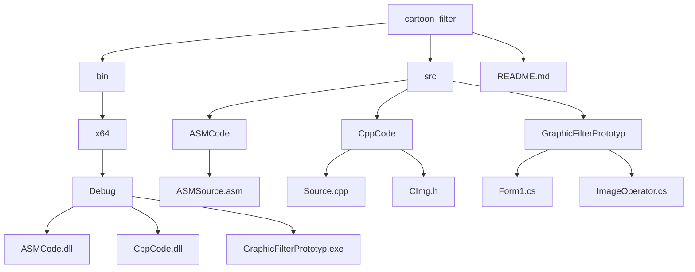

# cartoon_filter

## Description

A Windows Forms application that applies cartoon-like effects to images. The project demonstrates the integration of three different programming languages (C#, C++, and Assembly) to create an efficient image processing solution.

### Key Features
- Load and process various image formats (BMP, JPG, PNG)
- Apply cartoon-style filters to images
- Optimized performance using SIMD instructions in Assembly
- Multi-threaded processing utilizing all available CPU cores

### Technical Details
The project consists of three main components:
1. **C# Windows Forms Application**
   - Provides the user interface
   - Handles image loading and display
   - Manages the integration between components

2. **C++ DLL**
   - Implements basic pixel processing functions
   - Provides pixel value calculation algorithms

3. **Assembly DLL**
   - Contains optimized versions of image processing functions
   - Uses SIMD instructions for better performance
   - Processes multiple pixels simultaneously

### System Requirements
- Windows operating system
- x64 architecture
- .NET Framework support

### Project Structure



### Building the Project
Open the solution in Visual Studio and build all projects. Make sure to build for x64 architecture.

### Using the Application
1. Launch the application
2. Click "Load Image" to select an image file
3. Adjust the filter parameters:
   - Density: Controls the level of detail in the cartoon effect
   - Other parameters can be adjusted using the provided sliders
4. Click "Apply Filter" to process the image
5. Save the processed image using "Save Image" button

### Parameters
#### Density
The density parameter controls how detailed the cartoon effect will be:
- Lower values (1-3): More cartoon-like, fewer details
- Medium values (4-6): Balanced effect with moderate detail
- Higher values (7-10): More detailed, closer to the original image

The `density` parameter (called `value` in the code) controls how much the image colors are simplified. Lower values cause a stronger cartoon/posterization effect (more color grouping), higher values keep the image closer to the original. Technically, it is the divider in the modulo operation for each color channel.

**Improvements for code readability, performance, best practices, and error handling:**

1. **Code readability and maintainability:**
   - Use descriptive variable names instead of generic ones like `value`. For example, rename `value` to `density` to match the parameter's conceptual meaning.
   - Add comments explaining the purpose of key operations, especially the quantization logic.
   - Encapsulate the quantization logic in a dedicated function for reuse and clarity.

2. **Performance optimization:**
   - Avoid repeated modulo operations inside tight loops by precomputing values where possible.
   - Use integer arithmetic for color quantization to improve speed.
   - Consider clamping the `density` parameter to valid ranges upfront to avoid unnecessary checks inside loops.

3. **Best practices and patterns:**
   - Validate input parameters early and throw meaningful errors or warnings if out of expected range.
   - Use constants or configuration parameters for magic numbers.
   - Follow consistent naming conventions and code formatting.

4. **Error handling and edge cases:**
   - Handle edge cases where `density` might be zero or negative to prevent division/modulo by zero errors.
   - Provide fallback or default values if input is invalid.
   - Ensure the function gracefully handles extreme values without crashing or producing unexpected results.

**Example improved code snippet:**

```cpp
// Quantizes a single color channel value based on the density parameter.
// density controls the level of color simplification: higher density means finer color detail.
inline uint8_t QuantizeColorChannel(uint8_t colorValue, int density) {
    if (density <= 0) {
        // Avoid division by zero or negative density; return original color.
        return colorValue;
    }
    // Quantize color by reducing the number of possible shades.
    // This groups colors into buckets of size 'density'.
    return static_cast<uint8_t>((colorValue / density) * density);
}

// Usage example inside image processing loop:
// for each pixel channel:
//   pixel[channel] = QuantizeColorChannel(pixel[channel], density);
```

### Troubleshooting
If you encounter any issues:
- Ensure all DLLs are present in the application directory
- Verify your system meets the minimum requirements
- Check if the input image format is supported

---

## Opis

Aplikacja Windows Forms służąca do nakładania efektów komiksowych na obrazy. Projekt demonstruje integrację trzech różnych języków programowania (C#, C++ i Assembly) w celu stworzenia wydajnego rozwiązania do przetwarzania obrazów.

### Kluczowe funkcje
- Wczytywanie i przetwarzanie różnych formatów obrazów (BMP, JPG, PNG)
- Nakładanie filtrów typu komiksowego na obrazy
- Zoptymalizowana wydajność dzięki instrukcjom SIMD w Assembly
- Przetwarzanie wielowątkowe wykorzystujące wszystkie dostępne rdzenie CPU

### Szczegóły techniczne
Projekt składa się z trzech głównych komponentów:
1. **Aplikacja Windows Forms w C#**
   - Zapewnia interfejs użytkownika
   - Obsługuje wczytywanie i wyświetlanie obrazów
   - Zarządza integracją między komponentami

2. **Biblioteka DLL w C++**
   - Implementuje podstawowe funkcje przetwarzania pikseli
   - Dostarcza algorytmy obliczania wartości pikseli

3. **Biblioteka DLL w Assembly**
   - Zawiera zoptymalizowane wersje funkcji przetwarzania obrazów
   - Wykorzystuje instrukcje SIMD dla lepszej wydajności
   - Przetwarza wiele pikseli jednocześnie

### Wymagania systemowe
- System operacyjny Windows
- Architektura x64
- Wsparcie dla .NET Framework

### Struktura projektu


### Kompilacja projektu
Otwórz rozwiązanie w Visual Studio i skompiluj wszystkie projekty. Upewnij się, że wybrana jest architektura x64.

### Użycie aplikacji
1. Uruchom aplikację
2. Kliknij "Wczytaj obraz", aby wybrać plik graficzny
3. Dostosuj parametry filtra:
   - Density: kontroluje poziom szczegółowości efektu komiksowego
   - Pozostałe parametry można regulować za pomocą suwaków
4. Kliknij "Zastosuj filtr", aby przetworzyć obraz
5. Zapisz przetworzony obraz przyciskiem "Zapisz obraz"

### Parametr density
Parametr density kontroluje szczegółowość efektu komiksowego:
- Niższe wartości (1-3): bardziej komiksowy, mniej detali
- Średnie wartości (4-6): zbalansowany efekt
- Wyższe wartości (7-10): więcej detali, bliżej oryginału

Parametr `density` (w kodzie jako `value`) określa stopień uproszczenia kolorów na obrazie. Niższe wartości powodują silniejszy efekt komiksowy (większe grupowanie kolorów), wyższe wartości zachowują więcej oryginalnych kolorów. Technicznie jest to dzielnik w operacji modulo dla każdej składowej koloru.

**Sugestie dotyczące czytelności kodu, wydajności, dobrych praktyk i obsługi błędów:**

1. **Czytelność i utrzymanie kodu:**
   - Używaj opisowych nazw zmiennych zamiast ogólnych, np. `density` zamiast `value`
   - Dodaj komentarze wyjaśniające kluczowe operacje, szczególnie logikę kwantyzacji
   - Wydziel logikę kwantyzacji do osobnej funkcji

2. **Optymalizacja wydajności:**
   - Unikaj powtarzających się operacji modulo w pętli, preobliczaj wartości gdzie to możliwe
   - Używaj arytmetyki całkowitoliczbowej
   - Sprawdzaj zakres parametru density na początku

3. **Dobre praktyki:**
   - Waliduj parametry wejściowe i zgłaszaj błędy przy nieprawidłowych wartościach
   - Używaj stałych dla magicznych liczb
   - Stosuj spójne nazewnictwo i formatowanie

4. **Obsługa błędów i przypadków brzegowych:**
   - Obsłuż przypadki density = 0 lub < 0, aby uniknąć dzielenia przez zero
   - Zapewnij wartości domyślne przy nieprawidłowych danych
   - Funkcja powinna działać stabilnie nawet dla skrajnych wartości

**Przykład poprawionej funkcji:**

```cpp
// Kwantyzacja pojedynczego kanału koloru na podstawie density
inline uint8_t KwantyzujKolor(uint8_t wartosc, int density) {
    if (density <= 0) {
        // Unikaj dzielenia przez zero
        return wartosc;
    }
    // Grupowanie kolorów w "kubełki" o rozmiarze density
    return static_cast<uint8_t>((wartosc / density) * density);
}
// Użycie w pętli przetwarzania pikseli:
// pixel[channel] = KwantyzujKolor(pixel[channel], density);
```

### Rozwiązywanie problemów
Jeśli napotkasz problemy:
- Upewnij się, że wszystkie DLL znajdują się w katalogu aplikacji
- Zweryfikuj wymagania systemowe
- Sprawdź, czy format obrazu jest obsługiwany
